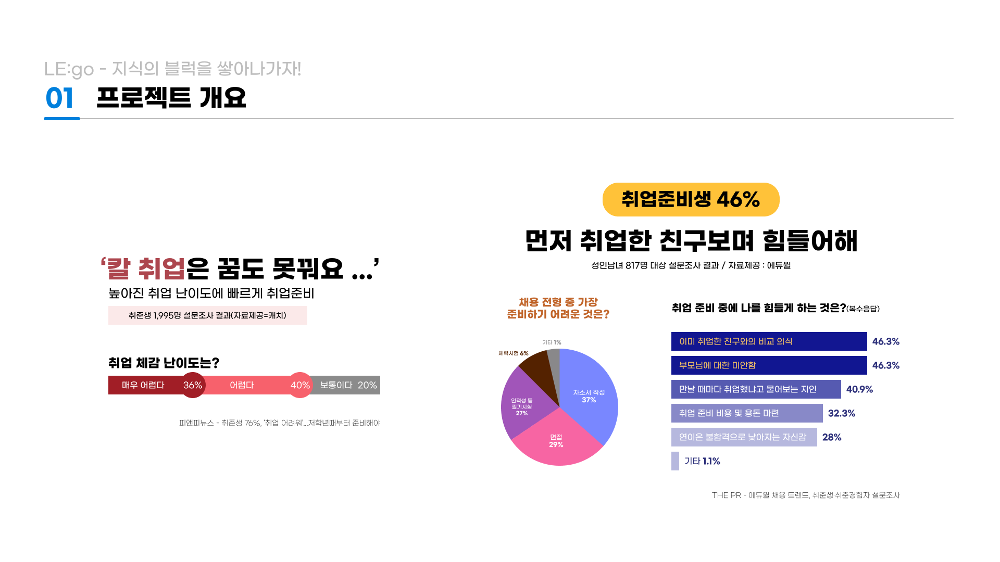
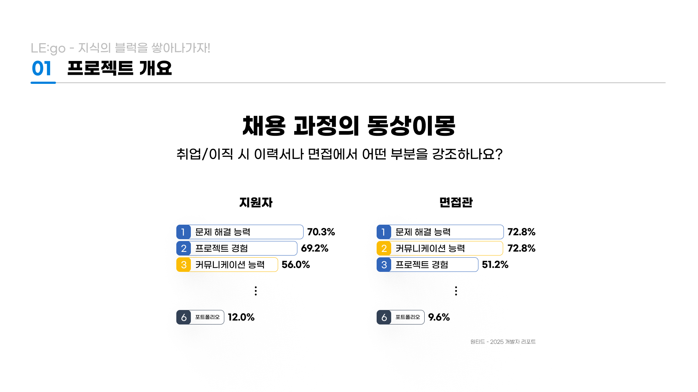

# 👷 레고(LEGO) - 지식의 블럭을 쌓아 나가자!

💻 **개발자 취업**을 위한 **기술면접 준비** 플랫폼

🔗 [Figma 바로가기](https://www.figma.com/slides/9dxeauvkdPTft2Gu6bMdNA/LE-go-%EA%B8%B0%ED%9A%8D%EC%9E%90%EB%A3%8C?node-id=1-791&t=5SOrXiOApubJsaVB-1)

## **🔎 기획 의도**

  

## 📝 ERD

  

## 💻 서비스 아키텍처

  

## 📝 요구사항 명세서

### 🔗 [Notion 링크]

  

## 💡주요 기능
