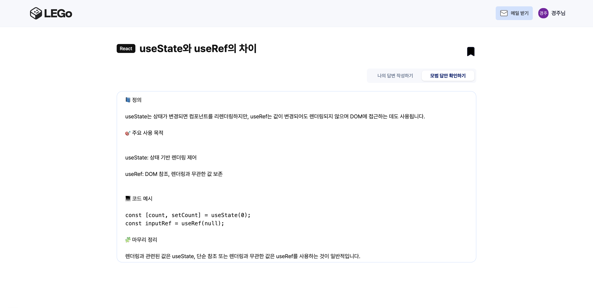
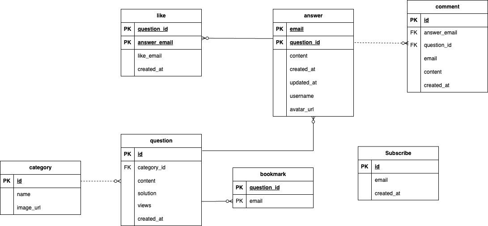
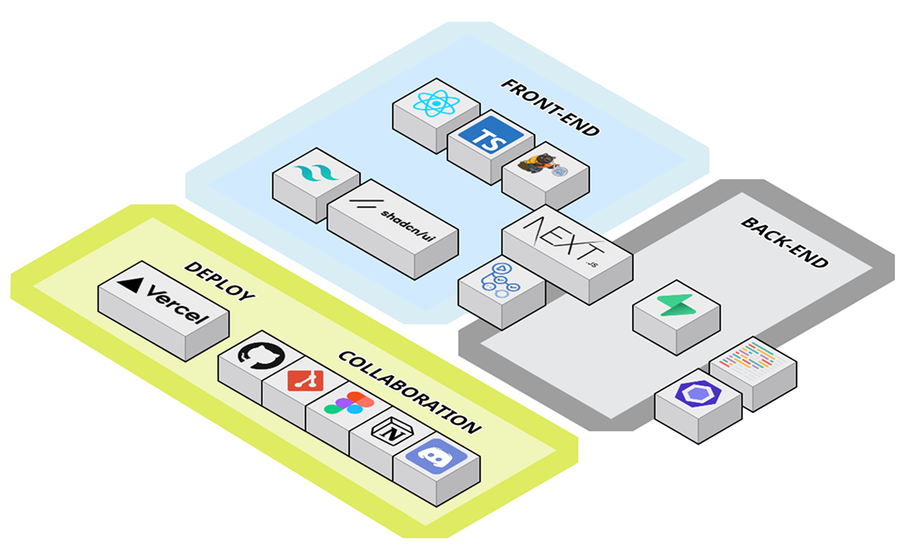

> # 🧱 레고(LEGo)

지식의 블럭을 쌓아나가자!

  
    
  
<strong>프로젝트 기간</strong> : 2025.04.07 - 2025.04.28

  
<strong>🔗 서비스 URL</strong> : <a href="https://lego-mail.vercel.app" target="_blank">LEGo 바로가기</a>

 

> # 🧚 팀 소개

<table align="center" style="border: 1px solid #3d444d">
  <tr>
    <td align="center">
       
      <a href="https://github.com/hoon95">김다훈</a> 
      팀장
    </td>
    <td align="center" style="border-left: 1px solid #3d444d; border-right: 1px solid #3d444d">
       
      <a href="https://github.com/darth12dfd">이규원</a> 
      팀원
    </td>
    <td align="center">
       
      <a href="https://github.com/kyoungjooo">이경주</a> 
      팀원
    </td>
  </tr>
</table>

  

> # 🔎 프로젝트 목적 및 필요성

<table align="center" bgcolor="white" width="100%" height="400" >
  <tr>
    <td align="center" valign="middle" width="100%">
      
    </td>
  </tr>
</table>
<table align="center" bgcolor="white" width="100%" height="400" >
  <tr>
    <td align="center" width="100%">
      
    </td>
  </tr>
</table>

### 1️⃣ 취업 준비의 어려움

- 무엇을 준비해야 할지 모르는 불안감
- 반복되는 실패로 인한 자신감 하락
- 점점 어려워지는 채용 시장 속에서 조급해지는 마음과 스스로에 대한 두려움

### 2️⃣ 채용 과정에서 중요한 요소

- 기업이 신입에게 기대하는 역량은 문제 해결, 커뮤니케이션 능력
- 하지만 이러한 역량을 쌓을 수 있는 환경과 루트는 부족한 상황

### 3️⃣ 학습 플랫폼의 필요성

- 기술면접 질문을 한눈에 확인하고,
- 개발자 간 지식 공유를 통해 답변을 함께 만들어가며
- 메일로 간편하게 질문을 받아보며 학습 루틴을 형성할 수 있는 서비스가 필요!

  

> # 📌 프로젝트 소개

### **레고는 프론트엔드 개발자를 위한 기술 면접 준비 플랫폼입니다.**

혼자 면접을 준비하는 과정은 어렵고 외롭습니다. 🫠  
레고에서는 개발자들과 함께 질문과 답변을 나누며, 효과적으로 면접을 준비할 수 있습니다.

### ✅ 꾸준한 학습 습관 형성

매일 한 문제씩 메일로 받아보며, 자연스럽게 학습 루틴을 만들고 지속적인 학습 습관을 기를 수 있습니다.

### ✅ 함께 성장하는 면접 준비

다양한 개발자들과 기술 면접 질문과 답변을 공유하며, 보다 넓은 시야를 갖고 실력을 키울 수 있습니다.

### ✅ 필수 개념 정리로 체계적인 준비

프론트엔드 면접에서 자주 등장하는 핵심 질문들을 주제별로 정리해 제공함으로써, 보다 효율적이고 체계적인 학습이 가능합니다.

  

> # 주요 기능

## 📬 하루 한 문제 메일 알림

매일 아침 메일로 한 개의 기술 면접 질문을 받아보며, 자연스럽게 꾸준한 학습 습관을 만들어갈 수 있어요.

<table align="center" width="100%">
  <tr>
    <td align="center" valign="middle" width="50%">
  
    </td>
   <td align="center" valign="middle" width="50%">
  
    </td>
  </tr>
</table>

## 🔎 카테고리별 문제 탐색

프론트엔드 핵심 주제별 질문을 조회할 수 있으며, 카테고리·인기순·최신순·북마크 여부로 필터링해 정렬할 수 있어요.

<table align="center" width="100%">
  <tr>
    <td align="center" valign="middle" width="100%">
  
    </td>
  </tr>
</table>

## 💁🏻 답변 등록 & 모범 답안 비교

각 질문에 대해 답변을 작성하고 모범답안과 비교할 수 있으며, 작성한 답변은 저장해 히스토리로 관리할 수 있어요.

  

## 👯 다른 사람 답변 확인

다른 사람들의 답변을 확인하고 좋아요 할 수 있어요

<table align="center"width="100%">
  <tr>
  <td align="center" valign="middle" width="50%">
  
    </td>
  </tr>
</table>

## 👯 마이페이지-나의 활동 기록

마이페이지에서 내가 작성한 답변, 좋아요 누른 답변 등 나의 학습 기록을 시각적으로 확인할 수 있어요.

<table align="center"width="100%">
  <tr>
  <td align="center" valign="middle" width="100%">
  
    </td>
  </tr>
</table>
<table align="center"width="100%">
  <tr>
  <td align="center" valign="middle" width="100%">
  
    </td>
  </tr>
</table>

## 📝 ERD

<table align="center"width="100%" bgcolor="white">
  <tr>
  <td align="center" valign="middle" width="100%">
  
    </td>
  </tr>
</table>

## ⚙️ 기술 스택

  

## 📅 일정 관리

- **4/07: 프로젝트 기획**
  - 브레인 스토밍
  - 기술 스택 선정 및 인사이트
- **4/08~4/18: 시스템 아키텍처 설계**
  - 기능 명세서 작성
  - ERD 작성 및 수정(~4/18)
  - 시스템 아키텍처 및 폴더 구조 설계
    - 클린 아키텍처 + DDD 기반에 RestFul API를 활용한 설계
  - API DOC 작성(~4/17)
  - 와이어 프레임 구성
- **4/10~4/14: 기획 발표 및 공통 스타일 및 팀 컨벤션 정리, 역할 분담**
  - 수파베이스 DB 설정
- **4/15~4/24: 담당 파트 구현 및 코드 리팩토링**
- **4/25~28: 빌드 및 배포**
